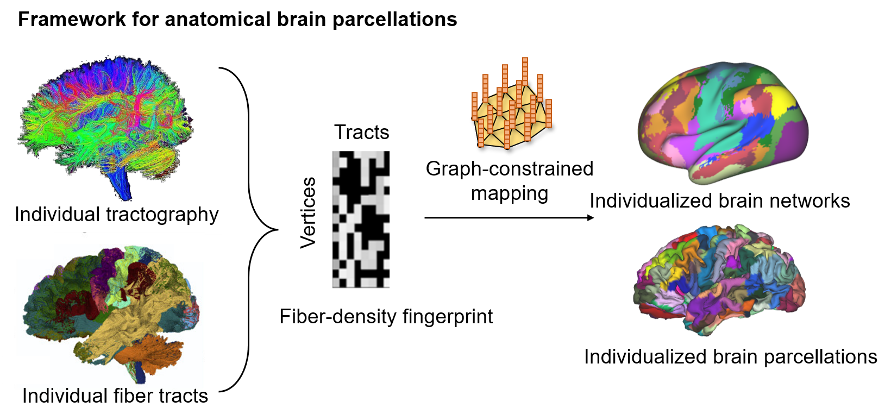
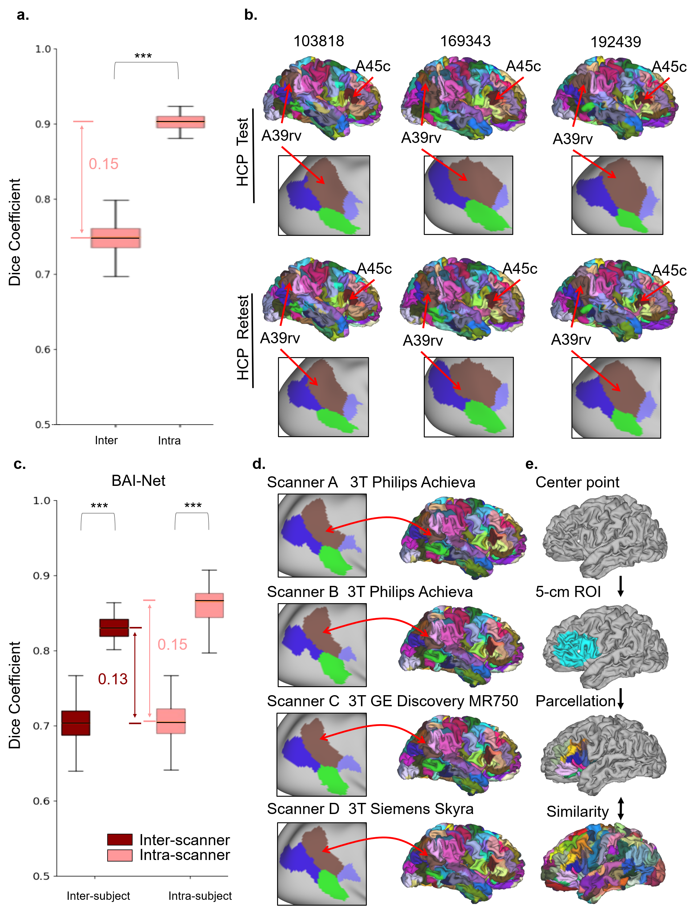

# BAI-Net: Individualized Anatomical Cerebral Cartography using Graph Neural Network

by: Ma Liang at 2020/4/30

## Introduction
The pipeline use the fiber connection fingerprint derived from group brainnetome atlas to parcellate the individual cerebral cortex. This pipline is trained on the 32kLR surface, could also be applied into other HCP-styled surface (.surf.gii).





## Requirement
```
the pipline dependency: 
    Python----> tensorflow-gpu >= 1.12 (tensorflow 2.0 has not been tested， tensorflow 1.15 might need revised code)
        ----> TractSeg >=2.1
    FSL 5.0 (some methods in 6.0 is not compatible )
    FreeSurfer >= 5.3
    workbench 
```
```
the TractSeg dependency:
    Python---> pytorch >= 1.0 
    FSL
    Mrtrix 3
    ANTS
```
After configuration, you need to revise the software path on the pipline/soft_path.sh

## Data Structure

We provide a flexible data structure for data storage, that data pre-processed in different locations can be directly calculated. If the data is not pre-processed in any location, its complete date storage format of final result is below:

```
---workdir--------------------------------
     |
     |----{$sub_name}--------------------------------
     |      |
     |      |------3D--------------------------------
     |      |       |---T1w.nii.gz
     |      |       |---T1_1mm.nii.gz
     |      |      
     |      |------DTI--------------------------------
     |      |       |---data.nii.gz
     |      |       |---bval
     |      |       |---bvec
     |      |       |---nodif_brain_mask.nii.gz          
     |      |       |---dti_FA.nii.gz
     |      |       |---LowRes_Fibers.nii.gz
     |      |       |---LowResMask.nii.gz
     |      |
     |      |------xfms-------------------------------------
     |      |       |---DTI_2_T1_1mm.mat
     |      |       |---T1_1mm_2_DTI.mat
     |      |     
     |      |------{$sub_name}-------------------------------
     |      |       |---fsaverage_LR32k
     |      |                 |---{$sub_name}.R.white.32k_fs_LR.surf.gii
     |      |                 |---{$sub_name}.L.white.32k_fs_LR.surf.gii
     |      |                 |---{$sub_name}.R.pial.32k_fs_LR.surf.gii
     |      |                 |---{$sub_name}.L.pial.32k_fs_LR.surf.gii             
     |      |     
     |      |------surf--------------------------------     
     |      |       |---stop
     |      |       |---wtstop
     |      |       |---white.R.asc
     |      |       |---white.L.asc
     |      |       |---pial.R.asc
     |      |       |---pial.L.asc
     |      |       |---adj_matrix_seed_R.npz
     |      |       |---adj_matrix_seed_L.npz
     |      |
     |      |------DTI.bedpostX--------------------------------
     |      |       |---dyads1.nii.gz
     |      |       |---dyads2.nii.gz
     |      |       |---dyads3.nii.gz 
     |      |    
     |      |------tractseg_output--------------------------------
     |      |       |---bundle_segmentations.nii.gz
     |      |
     |      |------{$sub_name}_R_probtrackx_omatrix2--------------------------------
     |      |       |---fdt_matrix2.npz
     |      |       |---finger_print_fiber.npz
     |      |
     |      |------{$sub_name}_R_probtrackx_omatrix2--------------------------------
     |      |       |---fdt_matrix2.npz
     |      |       |---finger_print_fiber.npz
     |      |
     |      |------{$sub_name}_config.ini
     |      |------{$sub_name}.indi.R.label.gii
     |      |------{$sub_name}.indi.L.label.gii
     |      |
     |----{$sub_name}--------------------------------
     .......
     |----{$sub_name}--------------------------------
     .......
```


## Model Pipline:

the pipline contain 8 steps, corresponding to the file begin with 'S'. Each step file can be run sepretely aftering running the previous steps. The time cost of pipline is around 12 hours for two GPUs to work. 
```
S01_miniprocess.py           ( CPU only)
S02_registration.py          ( CPU only)
S03_build_surface.py         ( CPU only, take 10 hours, suggested run singlely) 
S04_fiber_orientation.py     ( GPU optional)
S05_fiber_tract.py           ( GPU required)
S06_probtrack.py             ( GPU required)
S07_postprobtrack.py         ( CPU only)
S08 in folder ../GCN_model   ( GPU required)
```
It is suggested that run the pipline of **'parcellation.py'** in the pipeline folder that has been parllatally structured. The file path of pipeline is record in **'{sub_name}_config.ini'** for the checking, and it will update every steps. The final parcellation result is  {sub_name}.indi.R.label.gii and {sub_name}.indi.R.label.gii 

## Some Examples of Running Pipline:

### If your data is raw data:

```
import numpy as np
from pathlib import Path
with open('namelist.txt','r') as f:
    namelist = [ str(line.strip()) for line in f.readlines()]
softwaredir = Path('xxx')
workdir = Path('xxx')
for sub in namelist:
    print('processing', sub)
    t1 = str(workdir/sub/'T1'/'T1_brain.nii.gz')
    dti = str(workdir/sub/'DTI'/'data_eddy.nii.gz')
    bval = str(workdir/sub/'DTI'/'bvals')
    bvec = str(workdir/sub/'DTI'/'bvecs')
    os.system('python parcellation.py --softwaredir {} -s {} --t1 {} --dti {} \
    --bval {} --bvec {} --tract_MNIspace --begin_step {} --end_step {} --card1 {} \
    --card2 {}'.format( str(softwaredir), str(subdir), t1, dti, bval, bvec, 1, 8, '0', 'None'))

```

### If your T1 and DTI is preprocessed:

```
with open('namelist.txt','r') as f:
    namelist = [ str(line.strip()) for line in f.readlines()]
softwaredir = Path('xxx')
workdir = Path('xxx')
for sub in namelist:
    print('processing', sub)
    t1 = str(workdir/sub/'T1'/'T1_brain.nii.gz')
    dti = str(workdir/sub/'DTI'/'data_eddy.nii.gz')
    bval = str(workdir/sub/'DTI'/'bvals')
    bvec = str(workdir/sub/'DTI'/'bvecs')
    nodifmask = str(workdir/sub/'DTI'/'nodif_brain_mask.nii.gz')
    os.system('python parcellation.py --softwaredir {} -s {} --t1 {} --dti {} \
    --bval {} --bvec {} --nodif_brain_mask {} --t1_preprocessed --dti_preprocessed \
    --tract_MNIspace --begin_step {} --end_step {} --card1 {} --card2 {}'.format( softwaredir, (subdir), t1, dti, bval, bvec, nodifmask, 1, 8, '0', 'None'))
```

### If you has run the 1 and 2, you want to run step 3 singlely:

```
with open('namelist.txt','r') as f:
    namelist = [ str(line.strip()) for line in f.readlines()]
softwaredir = Path('xxx')
workdir = Path('xxx')
for sub in namelist:
    print('processing', sub)
    t1 = str(workdir/sub/'T1'/'T1_brain.nii.gz')
    dti = str(workdir/sub/'DTI'/'data_eddy.nii.gz')
    bval = str(workdir/sub/'DTI'/'bvals')
    bvec = str(workdir/sub/'DTI'/'bvecs')
    os.system('python parcellation.py --softwaredir {} -s {} --t1 {} --dti {} \
    --bval {} --bvec {} --tract_MNIspace --begin_step {} --end_step {} --card1 {} --card2 {}'.format( softwaredir, (subdir), t1, dti, bval, bvec, 3, 3, '0', 'None'))
```

### If you want to referene with prepared data in linux system:

sublist=./sub_list.txt

for hemi in L R;
do
modeldir=/n04dat01/atlas_group/lma/populationGCN/BAI_Net/BAI-Net_MSM/tf_BNA_0_5_${hemi}/
dataset=/n04dat01/atlas_group/lma/HCP_test_retest/MSM/HCP_test
python /n04dat01/atlas_group/lma/populationGCN/BAI_Net/BAI-Net_MSM/validation_test.py --sublist ${sublist} --hemisphere ${hemi} --dataset ${dataset} --modeldir ${modeldir}

done


## Model Parameters
```
As mentioned above, we provide the flexible of data structure, so some data path and condition must be provided.
--softwaredir: the folder of this pipeline. (must be provided)
-s/--subdir: the data folder for a sub, normally under the workdir, (etc $workdir/$sub) (must be provided)
--t1: t1w filepath, (must be provided)
--dti --bval and --bvec : the filepath of Diffusion MRI data, corresponding b values and corresponding b vectors (must be provided)
--begin_step and --end_step : from begin number to end_number of step in pipeline
--t1_preprocessed: if the T1 is in 1mm, preprocessed for producing the relavent surface using Freesurfer software'), default false.
--dti_preprocessed: if the DTI is preprocessed, default false)
--nodif_brain_mask: the brain mask in diffusion MRI. If you set dti_preprocessed True, this term is required.
--dti_fa: FA Value of diffusion MRI.
--xfms : transfer matrix from T1 space to DTI space eg. T1_1mm_2_DTI.mat
--ANTS : if use ANTS to register the T1 space to DTI space. In preactice, it shown a better registration performence using ANTS
--bedpost_dir': the folder of FSL Bedpost Result Dictionary, the result of fiber orientations
--fsaverage_LR32k, Freesurfer Result Dictionary
--MSMALL, whether the surface is registered by multimodel registration.
--surface_begin_name : Surface begin name in Freesurfer Result Dictionary, if fsaverage_LR32k provided, this terms is required, default name is sub_name.
--tractseg_dir : The folder of TractSeg Result, fiber segmentation.
--tract_MNIspace : for the non-HCP dataset, it is suggested to be True
--card1: First Cuda Card Number
--card2: Second Cuda Card Number, whcih also can be absent with 'None'
--atlas : the group priors used for individual
```

## Publications
L. Ma et al., "BAI-Net: Individualized Anatomical Cerebral Cartography Using Graph Neural Network," in IEEE Transactions on Neural Networks and Learning Systems, vol. 35, no. 6, pp. 7446-7457, June 2024, doi: 10.1109/TNNLS.2022.3213581.

